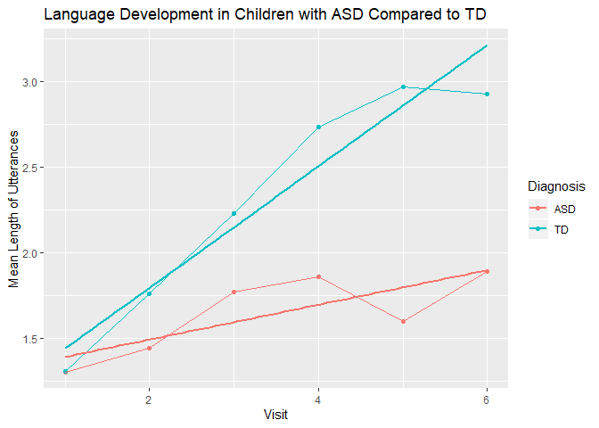
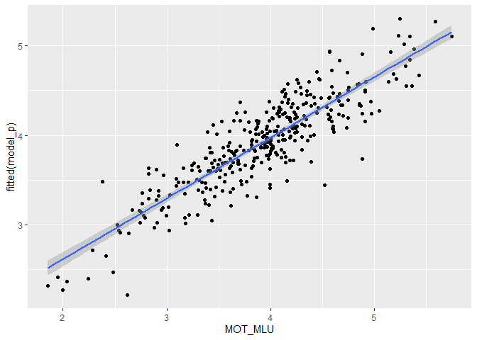

Assignment 2
============

In this assignment you will have to discuss a few important questions
(given the data you have). More details below. The assignment submitted
to the teachers consists of: - a report answering and discussing the
questions (so we can assess your conceptual understanding and ability to
explain and critically reflect) - a link to a git repository with all
the code (so we can assess your code)

Part 1 - Basic description of language development - Describe your
sample (n, age, gender, clinical and cognitive features of the two
groups) and critically assess whether the groups (ASD and TD) are
balanced - Describe linguistic development (in terms of MLU over time)
in TD and ASD children (as a function of group). - Describe how parental
use of language (in terms of MLU) changes over time. What do you think
is going on? - Include individual differences in your model of language
development (in children). Identify the best model.

Part 2 - Model comparison - Discuss the differences in performance of
your model in training and testing data - Which individual differences
should be included in a model that maximizes your ability to
explain/predict new data? - Predict a new kid’s performance (Bernie) and
discuss it against expected performance of the two groups

Part 3 - Simulations to plan a new study - Report and discuss a power
analyses identifying how many new kids you would need to replicate the
results

The following involves only Part 1.

Learning objectives
-------------------

-   Summarize and report data and models
-   Critically apply mixed effects (or multilevel) models
-   Explore the issues involved in feature selection

Quick recap
===========

Autism Spectrum Disorder is often related to language impairment.
However, this phenomenon has not been empirically traced in detail: i)
relying on actual naturalistic language production, ii) over extended
periods of time.

We therefore videotaped circa 30 kids with ASD and circa 30 comparison
kids (matched by linguistic performance at visit 1) for ca. 30 minutes
of naturalistic interactions with a parent. We repeated the data
collection 6 times per kid, with 4 months between each visit. We
transcribed the data and counted: i) the amount of words that each kid
uses in each video. Same for the parent. ii) the amount of unique words
that each kid uses in each video. Same for the parent. iii) the amount
of morphemes per utterance (Mean Length of Utterance) displayed by each
child in each video. Same for the parent.

This data is in the file you prepared in the previous class.

NB. A few children have been excluded from your datasets. We will be
using them next week to evaluate how good your models are in assessing
the linguistic development in new participants.

This RMarkdown file includes 1) questions (see above). Questions have to
be answered/discussed in a separate document that you have to directly
send to the teachers. 2) A break down of the questions into a guided
template full of hints for writing the code to solve the exercises. Fill
in the code and the paragraphs as required. Then report your results in
the doc for the teachers.

REMEMBER that you will have to have a github repository for the code and
send the answers to Kenneth and Riccardo without code (but a link to
your github/gitlab repository). This way we can check your code, but you
are also forced to figure out how to report your analyses :-)

Before we get going, here is a reminder of the issues you will have to
discuss in your report:

1- Describe your sample (n, age, gender, clinical and cognitive features
of the two groups) and critically assess whether the groups (ASD and TD)
are balanced 2- Describe linguistic development (in terms of MLU over
time) in TD and ASD children (as a function of group). 3- Describe how
parental use of language (in terms of MLU) changes over time. What do
you think is going on? 4- Include individual differences in your model
of language development (in children). Identify the best model.

Let’s go
========

### Loading the relevant libraries

Load necessary libraries : what will you need? - e.g. something to deal
with the data - e.g. mixed effects models - e.g. something to plot with

### Define your working directory and load the data

If you created a project for this class and opened this Rmd file from
within that project, your working directory is your project directory.

If you opened this Rmd file outside of a project, you will need some
code to find the data: - Create a new variable called locpath
(localpath) - Set it to be equal to your working directory - Move to
that directory (setwd(locpath)) - Load the data you saved last time (use
read\_csv(fileName))

### Characterize the participants (Exercise 1)

Identify relevant variables: participants demographic characteristics,
diagnosis, ADOS, Verbal IQ, Non Verbal IQ, Socialization, Visit, Number
of words used, Number of unique words used, mean length of utterance in
both child and parents.

Make sure the variables are in the right format.

Describe the characteristics of the two groups of participants and
whether the two groups are well matched.

``` r
#We check the data
summary(df_train)
```

    ##        X               SUBJ           VISIT       Diagnosis
    ##  Min.   :  1.00   Min.   : 1.00   Min.   :1.000   ASD:166  
    ##  1st Qu.: 88.75   1st Qu.:16.00   1st Qu.:2.000   TD :186  
    ##  Median :176.50   Median :31.00   Median :3.000            
    ##  Mean   :176.50   Mean   :30.95   Mean   :3.452            
    ##  3rd Qu.:264.25   3rd Qu.:46.00   3rd Qu.:5.000            
    ##  Max.   :352.00   Max.   :61.00   Max.   :6.000            
    ##                                                            
    ##             Ethnicity   Gender       Age          ASD_level     
    ##  White           :305   F:295   Min.   :18.30   Min.   : 0.000  
    ##  African American: 12   M: 57   1st Qu.:28.55   1st Qu.: 0.000  
    ##  White/Latino    : 12           Median :35.91   Median : 5.000  
    ##  Asian           :  6           Mean   :36.52   Mean   : 7.162  
    ##  White/Asian     :  6           3rd Qu.:42.99   3rd Qu.:14.000  
    ##  Bangladeshi     :  5           Max.   :62.40   Max.   :25.000  
    ##  (Other)         :  6           NA's   :6       NA's   :235     
    ##   nonVerbalIQ       VerbalIQ     Socialization       MOT_MLU     
    ##  Min.   :13.00   Min.   : 8.00   Min.   : 38.00   Min.   :1.856  
    ##  1st Qu.:27.00   1st Qu.:16.00   1st Qu.: 75.00   1st Qu.:3.513  
    ##  Median :33.00   Median :22.00   Median : 94.00   Median :3.971  
    ##  Mean   :34.71   Mean   :25.93   Mean   : 90.23   Mean   :3.918  
    ##  3rd Qu.:43.00   3rd Qu.:36.00   3rd Qu.:103.00   3rd Qu.:4.300  
    ##  Max.   :50.00   Max.   :50.00   Max.   :125.00   Max.   :5.744  
    ##  NA's   :178     NA's   :236     NA's   :2                       
    ##     CHI_MLU        types_MOT       types_CHI       tokens_MOT  
    ##  Min.   :0.000   Min.   : 74.0   Min.   :  0.0   Min.   : 209  
    ##  1st Qu.:1.204   1st Qu.:298.0   1st Qu.: 29.0   1st Qu.:1441  
    ##  Median :1.857   Median :352.5   Median :100.0   Median :1839  
    ##  Mean   :1.993   Mean   :354.5   Mean   :104.7   Mean   :1832  
    ##  3rd Qu.:2.758   3rd Qu.:410.0   3rd Qu.:163.2   3rd Qu.:2260  
    ##  Max.   :4.365   Max.   :601.0   Max.   :307.0   Max.   :3182  
    ##                                                                
    ##    tokens_CHI      ASD_level_1     nonVerbalIQ_1     VerbalIQ_1   
    ##  Min.   :   0.0   Min.   : 0.000   Min.   :13.00   Min.   : 8.00  
    ##  1st Qu.: 138.5   1st Qu.: 0.000   1st Qu.:24.00   1st Qu.:14.00  
    ##  Median : 353.0   Median : 4.500   Median :27.00   Median :18.00  
    ##  Mean   : 389.8   Mean   : 7.136   Mean   :26.37   Mean   :18.84  
    ##  3rd Qu.: 586.5   3rd Qu.:14.000   3rd Qu.:29.00   3rd Qu.:22.00  
    ##  Max.   :1294.0   Max.   :21.000   Max.   :42.00   Max.   :33.00  
    ##                                                                   
    ##  Socialization_1 
    ##  Min.   : 64.00  
    ##  1st Qu.: 76.75  
    ##  Median : 90.00  
    ##  Mean   : 89.43  
    ##  3rd Qu.:102.00  
    ##  Max.   :115.00  
    ## 

``` r
#we summarise the variables we would like to get an overview of

df_train %>% subset(df_train$VISIT == 1) %>% group_by(Diagnosis) %>% dplyr::summarise(N = n(), MeanAge = mean(Age, NA.RM=T), FemaleN=sum(Gender=="F"), MeanVerbalIQ = mean(VerbalIQ, NA.RM=T), NonVerbalIQ = mean(nonVerbalIQ, NA.RM=T), SDAge = sd(Age, na.rm=T))
```

    ## # A tibble: 2 x 7
    ##   Diagnosis     N MeanAge FemaleN MeanVerbalIQ NonVerbalIQ SDAge
    ##   <fct>     <int>   <dbl>   <int>        <dbl>       <dbl> <dbl>
    ## 1 ASD          29    33.0      25         17.3        26.9  5.59
    ## 2 TD           32    20.4      26         20.2        26    1.49

The sample included mostly women across both groups.

\[REPORT THE RESULTS\]

Let’s test hypothesis 1: Children with ASD display a language impairment (Exercise 2)
-------------------------------------------------------------------------------------

### Hypothesis: The child’s MLU changes: i) over time, ii) according to diagnosis

Let’s start with a simple mixed effects linear model

Remember to plot the data first and then to run a statistical test. -
Which variable(s) should be included as fixed factors? - Which
variable(s) should be included as random factors?

``` r
#We plot the data
ggplot(df_train, aes(VISIT, CHI_MLU, colour = Diagnosis)) + stat_summary(fun.y = mean, geom = "point") + stat_summary(fun.y = mean, geom = "line", aes(group=Diagnosis))+ geom_smooth(method = lm, se=F) + labs(x="Visit", y="Mean Length of Utterances")+ ggtitle("Language Development in Children with ASD Compared to TD")
```



``` r
#The childre can vary in how fast they develope (therefore random slope) 
#Each child might vary from each other (random intercept)
model_int <- lmer(CHI_MLU ~ VISIT * Diagnosis + (1+VISIT|SUBJ), data = df_train)
```

    ## Warning in checkConv(attr(opt, "derivs"), opt$par, ctrl =
    ## control$checkConv, : Model failed to converge with max|grad| = 0.00252572
    ## (tol = 0.002, component 1)

``` r
#Convergence issue means: Step back. A lot is going on. You want a stable solution. If it doesn't it tell ypu there are convergence issues. 
model_plus <- lmer(CHI_MLU ~ VISIT + Diagnosis + (1+VISIT|SUBJ), data = df_train)
summary(model_int)
```

    ## Linear mixed model fit by REML. t-tests use Satterthwaite's method [
    ## lmerModLmerTest]
    ## Formula: CHI_MLU ~ VISIT * Diagnosis + (1 + VISIT | SUBJ)
    ##    Data: df_train
    ## 
    ## REML criterion at convergence: 572.5
    ## 
    ## Scaled residuals: 
    ##      Min       1Q   Median       3Q      Max 
    ## -2.47375 -0.52331 -0.08425  0.43358  2.73473 
    ## 
    ## Random effects:
    ##  Groups   Name        Variance Std.Dev. Corr 
    ##  SUBJ     (Intercept) 0.30947  0.5563        
    ##           VISIT       0.01192  0.1092   -0.17
    ##  Residual             0.16062  0.4008        
    ## Number of obs: 352, groups:  SUBJ, 61
    ## 
    ## Fixed effects:
    ##                   Estimate Std. Error       df t value Pr(>|t|)    
    ## (Intercept)        1.30476    0.12486 57.25215  10.450 6.93e-15 ***
    ## VISIT              0.10044    0.02724 59.42241   3.687 0.000494 ***
    ## DiagnosisTD       -0.21732    0.17246 57.34452  -1.260 0.212721    
    ## VISIT:DiagnosisTD  0.25344    0.03774 59.95599   6.716 7.65e-09 ***
    ## ---
    ## Signif. codes:  0 '***' 0.001 '**' 0.01 '*' 0.05 '.' 0.1 ' ' 1
    ## 
    ## Correlation of Fixed Effects:
    ##             (Intr) VISIT  DgnsTD
    ## VISIT       -0.443              
    ## DiagnosisTD -0.724  0.321       
    ## VISIT:DgnTD  0.320 -0.722 -0.445
    ## convergence code: 0
    ## Model failed to converge with max|grad| = 0.00252572 (tol = 0.002, component 1)

How would you evaluate whether the model is a good model?

``` r
p_load(MuMIn)
#We will use anova to test this (log likelyhood comparison method)
anova(model_plus, model_int)
```

    ## refitting model(s) with ML (instead of REML)

    ## Data: df_train
    ## Models:
    ## model_plus: CHI_MLU ~ VISIT + Diagnosis + (1 + VISIT | SUBJ)
    ## model_int: CHI_MLU ~ VISIT * Diagnosis + (1 + VISIT | SUBJ)
    ##            Df    AIC    BIC  logLik deviance  Chisq Chi Df Pr(>Chisq)    
    ## model_plus  7 605.42 632.47 -295.71   591.42                             
    ## model_int   8 572.46 603.37 -278.23   556.46 34.962      1  3.363e-09 ***
    ## ---
    ## Signif. codes:  0 '***' 0.001 '**' 0.01 '*' 0.05 '.' 0.1 ' ' 1

``` r
#We calculate the R squared
r.squaredGLMM(model_int)
```

    ## Warning: 'r.squaredGLMM' now calculates a revised statistic. See the help
    ## page.

    ##            R2m       R2c
    ## [1,] 0.3509609 0.8182941

Exciting right? Let’s check whether the model is doing an alright job at
fitting the data. Plot the actual CHI\_MLU data against the predictions
of the model fitted(model).

Now it’s time to report our results. Remember to report: - the estimates
for each predictor (beta estimate, standard error, p-value) - A plain
word description of the results - A plot of your model’s predictions
(and some comments on whether the predictions are sensible)

\[REPORT THE RESULTS\] CHI\_MLU was found to be significantly predicted
by the interaction of visit and diagnosis with beta = 1.3, (SE = 0.12),
t = 10.45, p &lt; 0.01. Hoewever a significant interaction effect
between visit and diagnosis with beta = 0.25, (SE = 0.04), t = 6.7, p
&lt; 0.01.

Linguistic development of children MLU is affected by the interaction of
visit and diagnosis with random effects including random intercepts for
subjects as well as by-visit random slopes for the effect of the
interaction of visit and diagnosis.

Let’s test hypothesis 2: Parents speak equally to children with ASD and TD (Exercise 3)
---------------------------------------------------------------------------------------

### Hypothesis: Parental MLU changes: i) over time, ii) according to diagnosis

``` r
#We make a regression for parental MLU changes predicted by time and diagnosis
model_p_int <- lmer(MOT_MLU ~ VISIT * Diagnosis + (1+VISIT|SUBJ), data = df_train)
model_p <- lmer(MOT_MLU ~ VISIT + Diagnosis + (1+VISIT|SUBJ), data = df_train)

#we compare the models
anova(model_p, model_p_int)
```

    ## refitting model(s) with ML (instead of REML)

    ## Data: df_train
    ## Models:
    ## model_p: MOT_MLU ~ VISIT + Diagnosis + (1 + VISIT | SUBJ)
    ## model_p_int: MOT_MLU ~ VISIT * Diagnosis + (1 + VISIT | SUBJ)
    ##             Df    AIC    BIC  logLik deviance Chisq Chi Df Pr(>Chisq)
    ## model_p      7 512.71 539.75 -249.35   498.71                        
    ## model_p_int  8 513.48 544.39 -248.74   497.48 1.227      1      0.268

``` r
# The interaction effect is not significant
#we get the output from the model without interaction effect
summary(model_p)
```

    ## Linear mixed model fit by REML. t-tests use Satterthwaite's method [
    ## lmerModLmerTest]
    ## Formula: MOT_MLU ~ VISIT + Diagnosis + (1 + VISIT | SUBJ)
    ##    Data: df_train
    ## 
    ## REML criterion at convergence: 511.3
    ## 
    ## Scaled residuals: 
    ##      Min       1Q   Median       3Q      Max 
    ## -2.88957 -0.59049 -0.03341  0.53589  2.99032 
    ## 
    ## Random effects:
    ##  Groups   Name        Variance Std.Dev. Corr 
    ##  SUBJ     (Intercept) 0.34056  0.5836        
    ##           VISIT       0.01168  0.1081   -0.70
    ##  Residual             0.14724  0.3837        
    ## Number of obs: 352, groups:  SUBJ, 61
    ## 
    ## Fixed effects:
    ##             Estimate Std. Error       df t value Pr(>|t|)    
    ## (Intercept)  3.23804    0.10683 78.03786  30.310  < 2e-16 ***
    ## VISIT        0.12026    0.01838 58.57598   6.542 1.65e-08 ***
    ## DiagnosisTD  0.50198    0.11523 58.92630   4.356 5.36e-05 ***
    ## ---
    ## Signif. codes:  0 '***' 0.001 '**' 0.01 '*' 0.05 '.' 0.1 ' ' 1
    ## 
    ## Correlation of Fixed Effects:
    ##             (Intr) VISIT 
    ## VISIT       -0.624       
    ## DiagnosisTD -0.568  0.003

``` r
#r squared
r.squaredGLMM(model_p)
```

    ##            R2m       R2c
    ## [1,] 0.2258908 0.6815365

``` r
#we plot the data
ggplot(df_train, aes(MOT_MLU, fitted(model_p))) + geom_point() + geom_smooth(method = lm)
```



Parent MLU is affected by time and diagnosis but probably not the
interaction between the two.

MOT\_MLU was found to be significantly predicted by the visit and
diagnosis with beta = 3.24, (SE = 0.11), t = 30.31, p &lt; .01. With a
significant main effects of visit with beta = 0.12., (SE = 0.02), t =
6.54, p &lt; .01 and diagnosis beta = 0.50, (SE = 0.12), t = 4.36, p
&lt; 0.01.

Unlike the CHI\_MLU there was no significant interaction effect between
visit and diagnosis.

Linguistic development of the mother MLU is affected by visit and
diagnosis with random effects including random intercepts for subjects
as well as by-visit random slopes for the effect of the visit and
diagnosis.

### Adding new variables (Exercise 4)

Your task now is to figure out how to best describe the children
linguistic trajectory. The dataset contains a bunch of additional
demographic, cognitive and clinical variables (e.g.verbal and non-verbal
IQ). Try them out and identify the statistical models that best
describes your data (that is, the children’s MLU). Describe how you
selected the best model and send the code to run the model to Riccardo
and Kenneth

``` r
library(MASS)
```

    ## 
    ## Attaching package: 'MASS'

    ## The following object is masked from 'package:dplyr':
    ## 
    ##     select

``` r
fit <- lmer(CHI_MLU~Diagnosis*VISIT*VerbalIQ_1+Ethnicity+Gender+nonVerbalIQ_1+Socialization_1+(1+VISIT|SUBJ),data=df_train)
step(fit, ddf = c("Satterthwaite"), alpha.random = 0.1, alpha.fixed = 0.05,
  reduce.fixed = TRUE, reduce.random = TRUE)
```

    ## Warning in checkConv(attr(opt, "derivs"), opt$par, ctrl =
    ## control$checkConv, : Model failed to converge with max|grad| = 0.00341407
    ## (tol = 0.002, component 1)

    ## Backward reduced random-effect table:
    ## 
    ##                             Eliminated npar  logLik    AIC    LRT Df
    ## <none>                                   22 -271.48 586.96          
    ## VISIT in (1 + VISIT | SUBJ)          0   20 -277.65 595.31 12.346  2
    ##                             Pr(>Chisq)   
    ## <none>                                   
    ## VISIT in (1 + VISIT | SUBJ)   0.002085 **
    ## ---
    ## Signif. codes:  0 '***' 0.001 '**' 0.01 '*' 0.05 '.' 0.1 ' ' 1
    ## 
    ## Backward reduced fixed-effect table:
    ## Degrees of freedom method: Satterthwaite 
    ## 
    ##                            Eliminated  Sum Sq Mean Sq NumDF  DenDF F value
    ## Socialization_1                     1 0.00093 0.00093     1 47.932  0.0058
    ## Gender                              2 0.00915 0.00915     1 48.549  0.0567
    ## Ethnicity                           3 0.71127 0.10161     7 63.420  0.6295
    ## nonVerbalIQ_1                       4 0.00007 0.00007     1 55.599  0.0004
    ## Diagnosis:VISIT:VerbalIQ_1          0 2.29576 2.29576     1 56.071 14.2625
    ##                               Pr(>F)    
    ## Socialization_1            0.9397636    
    ## Gender                     0.8128334    
    ## Ethnicity                  0.7296954    
    ## nonVerbalIQ_1              0.9839126    
    ## Diagnosis:VISIT:VerbalIQ_1 0.0003864 ***
    ## ---
    ## Signif. codes:  0 '***' 0.001 '**' 0.01 '*' 0.05 '.' 0.1 ' ' 1
    ## 
    ## Model found:
    ## CHI_MLU ~ Diagnosis + VISIT + VerbalIQ_1 + (1 + VISIT | SUBJ) + 
    ##     Diagnosis:VISIT + Diagnosis:VerbalIQ_1 + VISIT:VerbalIQ_1 + 
    ##     Diagnosis:VISIT:VerbalIQ_1

``` r
#We fit the model we just got
mod <- lmer(CHI_MLU ~ Diagnosis * VISIT + VerbalIQ_1 + (1 + VISIT | SUBJ), data = df_train)
```

    ## Warning in checkConv(attr(opt, "derivs"), opt$par, ctrl =
    ## control$checkConv, : Model failed to converge with max|grad| = 0.00495877
    ## (tol = 0.002, component 1)

``` r
summary(mod)
```

    ## Linear mixed model fit by REML. t-tests use Satterthwaite's method [
    ## lmerModLmerTest]
    ## Formula: CHI_MLU ~ Diagnosis * VISIT + VerbalIQ_1 + (1 + VISIT | SUBJ)
    ##    Data: df_train
    ## 
    ## REML criterion at convergence: 523.1
    ## 
    ## Scaled residuals: 
    ##      Min       1Q   Median       3Q      Max 
    ## -2.46862 -0.56911 -0.04808  0.46778  2.94758 
    ## 
    ## Random effects:
    ##  Groups   Name        Variance Std.Dev. Corr 
    ##  SUBJ     (Intercept) 0.11815  0.3437        
    ##           VISIT       0.01196  0.1094   -0.48
    ##  Residual             0.16058  0.4007        
    ## Number of obs: 352, groups:  SUBJ, 61
    ## 
    ## Fixed effects:
    ##                    Estimate Std. Error        df t value Pr(>|t|)    
    ## (Intercept)       -0.001265   0.163370 72.204321  -0.008 0.993841    
    ## DiagnosisTD       -0.435522   0.132967 58.657534  -3.275 0.001774 ** 
    ## VISIT              0.099935   0.027266 59.376910   3.665 0.000529 ***
    ## VerbalIQ_1         0.075465   0.007718 58.247712   9.778 6.78e-14 ***
    ## DiagnosisTD:VISIT  0.253857   0.037771 59.919513   6.721 7.51e-09 ***
    ## ---
    ## Signif. codes:  0 '***' 0.001 '**' 0.01 '*' 0.05 '.' 0.1 ' ' 1
    ## 
    ## Correlation of Fixed Effects:
    ##             (Intr) DgnsTD VISIT  VrIQ_1
    ## DiagnosisTD -0.274                     
    ## VISIT       -0.390  0.486              
    ## VerbalIQ_1  -0.814 -0.172 -0.005       
    ## DgnTD:VISIT  0.282 -0.672 -0.722  0.003
    ## convergence code: 0
    ## Model failed to converge with max|grad| = 0.00495877 (tol = 0.002, component 1)

In addition to the interaction of visit and diagnosis, the MLU of the
children is also correlated with VerbalIQ from visit 1.

Using AIC / nested F-tests as a criterium, we compared models of
increasing complexity and found that …

CHI\_MLU was found to be significantly predicted by Verbal IQ from the
first visit and the interaction of the visit and diagnosis with beta =
0.26., (SE = 0.04), t = 6.72, p &lt; .01.
