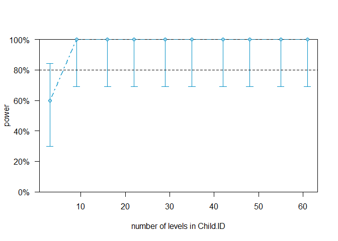
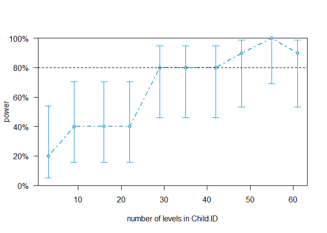

Welcome to the third exciting part of the Language Development in ASD exercise
------------------------------------------------------------------------------

In this part of the assignment, we try to figure out how a new study
should be planned (i.e. how many participants?) in order to have enough
power to replicate the findings (ensuring our sample size is adequate,
our alpha at 0.05 and our beta at 0.8): 1- if we trust the estimates of
the current study. Report the power analysis and comment on what you can
(or cannot) use its estimates for. 2- if we are skeptical of the current
study. Report the power analysis and comment on what you can (or cannot)
use its estimates for. 3- if we only have access to 30 participants.
Identify the power for each relevant effect and discuss whether it’s
worth to run the study and why The list above is also what you should
discuss in your code-less report.

Learning objectives
-------------------

-   Learn how to calculate statistical power
-   Critically appraise how to apply frequentist statistical power

### Exercise 1

How much power does your study have (if your model estimates are quite
right)? - Load your dataset (both training and testing), fit your
favorite model, assess power for your effects of interest (probably your
interactions). - Report the power analysis and comment on what you can
(or cannot) use its estimates for. - Test how many participants you
would have to have to replicate the findings (assuming the findings are
correct)

N.B. Remember that main effects are tricky once you have interactions in
the model (same for 2-way interactions w 3-way interactions in the
model). If you want to test the power of main effects, run a model
excluding the interactions. N.B. Check this paper:
<a href="https://besjournals.onlinelibrary.wiley.com/doi/full/10.1111/2041-210X.12504" class="uri">https://besjournals.onlinelibrary.wiley.com/doi/full/10.1111/2041-210X.12504</a>
You will be using: - powerSim() to calculate power - powerCurve() to
estimate the needed number of participants - extend() to simulate more
participants

First part: - Load your dataset (both training and testing), fit your
favorite model, assess power for your effects of interest (probably your
interactions).

``` r
#we load the files from last assignment
df_test <- read.csv("df_test.csv")
df_train <- read.csv("df_train.csv")

#Merge the dataset
df <- merge(df_test, df_train, all = T) 

#We remove NAs and make Child ID into a factor
df <- df[complete.cases(df[,c("CHI_MLU","Visit","Diagnosis","verbalIQ1","Child.ID")]),]
df$Child.ID <- as.factor(df$Child.ID)

#We fit an interaction model
model <- lmer(CHI_MLU ~ Visit * Diagnosis + (1+Visit|Child.ID),
              df, REML = F,
              control = lmerControl(optimizer = "nloptwrap", calc.derivs = FALSE)) #optimizer should be relevant

#We try with the interaction
sim <- powerSim(model , fixed("Visit:Diagnosis"), nsim = 50, seed = 1, progress = F)
```

    ## Warning in observedPowerWarning(sim): This appears to be an "observed
    ## power" calculation

``` r
sim #This gives me 100% power
```

    ## Power for predictor 'Visit:Diagnosis', (95% confidence interval):
    ##       100.0% (92.89, 100.0)
    ## 
    ## Test: Kenward Roger (package pbkrtest)
    ## 
    ## Based on 50 simulations, (0 warnings, 0 errors)
    ## alpha = 0.05, nrow = 387
    ## 
    ## Time elapsed: 0 h 0 m 17 s
    ## 
    ## nb: result might be an observed power calculation

``` r
fixef(model)["Visit:DiagnosisTD"]
```

    ## Visit:DiagnosisTD 
    ##         0.2436902

``` r
#which gives us an effect size of 0.24
```

-   Test how many participants you would have to have to replicate the
    findings (assuming the findings are correct)

``` r
#We will use a power curve
# plot the powercurve
powerCurveV1 = powerCurve(model, fixed("Visit:Diagnosis"), along = "Child.ID", 
                  nsim = 10, seed = 1, progress = F)
```

    ## Warning in observedPowerWarning(sim): This appears to be an "observed
    ## power" calculation

``` r
print(powerCurveV1)
```

    ## Power for predictor 'Visit:Diagnosis', (95% confidence interval),
    ## by number of levels in Child.ID:
    ##       3: 60.00% (26.24, 87.84) - 34 rows
    ##       9: 100.0% (69.15, 100.0) - 85 rows
    ##      16: 100.0% (69.15, 100.0) - 127 rows
    ##      22: 100.0% (69.15, 100.0) - 162 rows
    ##      29: 100.0% (69.15, 100.0) - 203 rows
    ##      35: 100.0% (69.15, 100.0) - 239 rows
    ##      42: 100.0% (69.15, 100.0) - 279 rows
    ##      48: 100.0% (69.15, 100.0) - 312 rows
    ##      55: 100.0% (69.15, 100.0) - 353 rows
    ##      61: 100.0% (69.15, 100.0) - 387 rows
    ## 
    ## Time elapsed: 0 h 0 m 23 s

``` r
plot(powerCurveV1)
```



``` r
#This shows us that we need at least 10 participants to receive power over 80%
```

### Exercise 2

How would you perform a more conservative power analysis? - Identify and
justify a minimum effect size for each of your relevant effects - take
the model from exercise 1 and replace the effects with the minimum
effect size that you’d accept. - assess the power curve by Child.ID,
identifying an ideal number of participants to estimate each effect - if
your power estimates do not reach an acceptable threshold simulate
additional participants and repeat the previous analysis - Report the
power analysis and comment on what you can (or cannot) use its estimates
for.

``` r
#We have to identify and justify a minimum effect size 
#we want a more conservative one so it has to be less than 0.24 as in the exercise above. 

#We replace the effect size for each relevant effects with 0.1
fixef(model)["Visit:DiagnosisTD"] <- 0.1 

#We asses the power curve
curve2 = powerCurve(model, fixed("Visit:Diagnosis"), along = "Child.ID", 
                  nsim = 10, seed = 1, progress = F)
plot(curve2)
```



``` r
print(powerCurveV1)
```

    ## Power for predictor 'Visit:Diagnosis', (95% confidence interval),
    ## by number of levels in Child.ID:
    ##       3: 60.00% (26.24, 87.84) - 34 rows
    ##       9: 100.0% (69.15, 100.0) - 85 rows
    ##      16: 100.0% (69.15, 100.0) - 127 rows
    ##      22: 100.0% (69.15, 100.0) - 162 rows
    ##      29: 100.0% (69.15, 100.0) - 203 rows
    ##      35: 100.0% (69.15, 100.0) - 239 rows
    ##      42: 100.0% (69.15, 100.0) - 279 rows
    ##      48: 100.0% (69.15, 100.0) - 312 rows
    ##      55: 100.0% (69.15, 100.0) - 353 rows
    ##      61: 100.0% (69.15, 100.0) - 387 rows
    ## 
    ## Time elapsed: 0 h 0 m 23 s

### Exercise 3

Assume you have only the resources to collect 30 kids (15 with ASD and
15 TDs). Identify the power for each relevant effect and discuss whether
it’s worth to run the study and why

``` r
#We will identify the power for the interaction

#We subset to two different dataframes
TD<-subset(df,Diagnosis=="TD")
ASD<-subset(df,Diagnosis=="ASD")

#we sample the TD data by uniqie child id
TD_try<-sample(unique(TD$Child.ID), 15) 

#ONly takes the sample participants
TD_new<-TD[TD$Child.ID %in% TD_try, ]

#Same with ASD
ASD_try<-sample(unique(ASD$Child.ID), 15) 

ASD_new<-ASD[ASD$Child.ID %in% ASD_try, ]

#We merge them together
merged<-merge(TD_new,ASD_new,all=TRUE)

model_m <- lmer(CHI_MLU ~ Visit * Diagnosis + (1+Visit|Child.ID),
              merged, REML = F,
              control = lmerControl(optimizer = "nloptwrap", calc.derivs = FALSE)) #optimizer

fixef(model_m)["Visit:DiagnosisTD"] <- 0.1 # let's try setting a fixed ef
powerSim(model_m , fixed("Visit:Diagnosis"), nsim = 200, seed = 1, progress = F)
```

    ## Power for predictor 'Visit:Diagnosis', (95% confidence interval):
    ##       63.00% (55.91, 69.70)
    ## 
    ## Test: Kenward Roger (package pbkrtest)
    ## 
    ## Based on 200 simulations, (0 warnings, 0 errors)
    ## alpha = 0.05, nrow = 179
    ## 
    ## Time elapsed: 0 h 0 m 44 s

``` r
#This gives us 58.8% power
```
